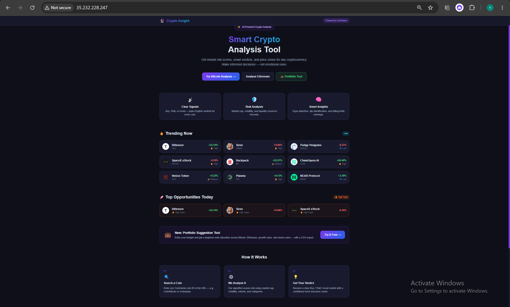
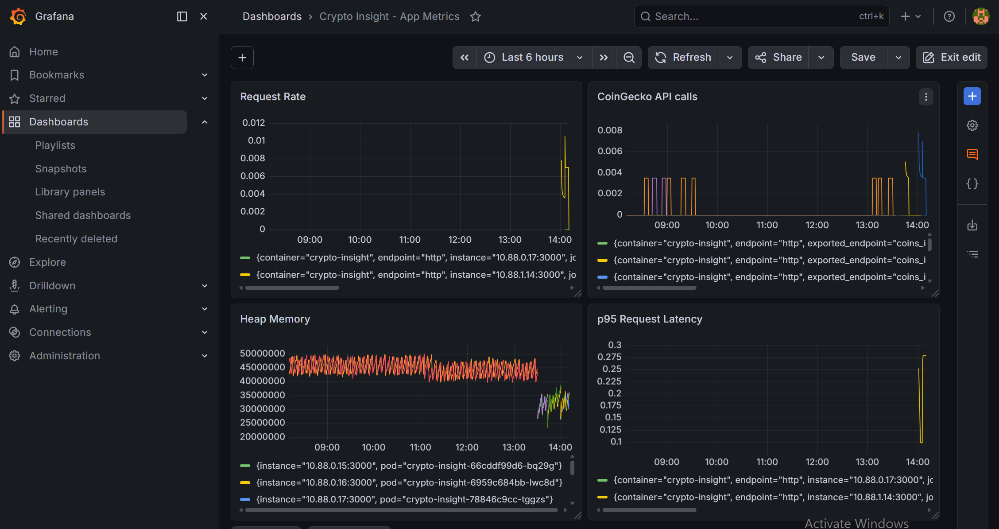
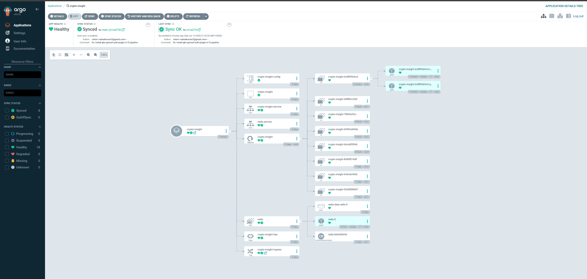

# Crypto Insight — Smart Crypto Analysis Tool

A real-time cryptocurrency analysis platform deployed on **Google Kubernetes Engine** with a full production-grade observability and GitOps stack.

**Live:** `http://35.232.228.247( Disabled right now to save up GKE costs)

---

## Screenshots

| App | Grafana Metrics | ArgoCD GitOps |
|---|---|---|
|  |  |  |

---

## Features

- 🔍 **Real-time Coin Analysis** — live market data from CoinGecko and Binance APIs
- 📊 **Risk Assessment** — multi-factor risk scoring (market cap, volatility, volume ratio, meme detection)
- 💡 **Smart Verdicts** — algorithmic Buy / Wait / Avoid signals with confidence levels
- 🎯 **Hype Score** — market sentiment and volatility indicators
- 💰 **Price Zones** — Buy Below / Current / Avoid Above levels
- 🚀 **Trending Coins** — real-time trending from CoinGecko
- ⚡ **Redis Caching** — 5-minute TTL, LRU eviction, sub-100ms cached responses
- ☸️ **Production K8s** — running on GKE with HPA, rolling deploys, zero downtime

---

## Platform Engineering Stack

This project goes beyond the app itself — the full cloud-native platform is built from scratch.

```
┌─────────────────────────────────────────────────────────┐
│                    GKE Cluster                          │
│                                                         │
│  ns: crypto-insight          ns: monitoring             │
│  ┌─────────────────┐         ┌─────────────────────┐   │
│  │ Deployment      │         │ Prometheus          │   │
│  │ replicas: 2→3   │◄────────│ Grafana             │   │
│  │ HPA: CPU 70%    │ scrape  │ AlertManager        │   │
│  │                 │         │ node-exporter       │   │
│  │ StatefulSet     │         │ kube-state-metrics  │   │
│  │ Redis + PVC     │         └─────────────────────┘   │
│  │                 │                                    │
│  │ nginx Ingress   │         ns: logging               │
│  └─────────────────┘         ┌─────────────────────┐   │
│         │                    │ Loki                │   │
│         │                    │ Promtail DaemonSet  │   │
└─────────┼────────────────────┼─────────────────────┘   
          │                    └─────────────────────┘
          ▼
   GCP Load Balancer
   35.232.228.247
```

### Kubernetes (GKE Standard)

| Resource | Details |
|---|---|
| Cluster | GKE Standard, us-central1-a, e2-standard-2 |
| App | Deployment, 2 replicas, rolling update (maxUnavailable: 0) |
| Redis | StatefulSet + PersistentVolumeClaim (standard-rwo, 1Gi) |
| Scaling | HorizontalPodAutoscaler, CPU target 70%, 2→3 replicas |
| Ingress | nginx Ingress Controller + GCP Load Balancer |
| Config | ConfigMap + Secrets for environment separation |

### Observability (Prometheus + Grafana)

Installed via `kube-prometheus-stack` Helm chart. Custom app metrics exposed via `prom-client`:

| Metric | Type | Description |
|---|---|---|
| `crypto_insight_http_requests_total` | Counter | HTTP requests by method, route, status |
| `crypto_insight_http_request_duration_seconds` | Histogram | p50/p95/p99 latency |
| `crypto_insight_coingecko_api_duration_seconds` | Histogram | External API call duration |
| `crypto_insight_redis_cache_hits_total` | Counter | Cache hits by key type |
| `crypto_insight_redis_cache_misses_total` | Counter | Cache misses by key type |
| `crypto_insight_active_requests` | Gauge | In-flight requests |

ServiceMonitor CRD auto-discovers pods and scrapes `/api/metrics` every 15 seconds.

### Logging (Loki + Promtail)

- Promtail runs as a DaemonSet — one pod per node, tails `/var/log/pods/**` automatically
- Loki aggregates logs with label-based indexing
- Query example: `{namespace="crypto-insight"} |= "Cache hit"` — filters cache hits across all pods

### CI/CD (GitHub Actions → Artifact Registry)

```
git push (code change)
  → GitHub Actions
    → docker build --no-cache
    → push to Google Artifact Registry (us-central1)
    → sed update image SHA in k8s/base/app-deployment.yaml
    → git commit + push YAML back to repo
  → ArgoCD detects YAML change
    → rolling deploy on GKE (zero downtime)
    → audit trail: every deploy traceable to a commit
```

### GitOps (ArgoCD)

- ArgoCD watches `k8s/base/` in this repo on the `main` branch
- Auto-sync enabled with `selfHeal: true` and `prune: true`
- Drift detection: any manual `kubectl` change is automatically corrected
- Full deployment history with rollback via UI

---

## Tech Stack

| Layer | Technology |
|---|---|
| Frontend | Next.js 16, React 19, TypeScript, Tailwind CSS v4 |
| Backend | Next.js API Routes, Node.js 20 |
| Caching | Redis 7 (StatefulSet, LRU eviction, 5min TTL) |
| Data | CoinGecko API (primary), Binance API (fallback) |
| Container | Docker (multi-stage build, standalone output) |
| Orchestration | Kubernetes, GKE Standard |
| Package Manager | Helm (prometheus-community, grafana charts) |
| Monitoring | Prometheus, Grafana, prom-client, ServiceMonitor |
| Logging | Loki, Promtail |
| CI/CD | GitHub Actions |
| Registry | Google Artifact Registry |
| GitOps | ArgoCD |
| Ingress | nginx Ingress Controller |

---

## Repository Structure

```
crypto-insight/
├── app/
│   ├── api/
│   │   ├── coin/[id]/route.ts      ← coin data API + metrics instrumentation
│   │   ├── coins/[id]/route.ts     ← coins listing
│   │   ├── metrics/route.ts        ← Prometheus /api/metrics endpoint
│   │   └── trending/route.ts       ← trending coins
│   ├── coin/[id]/page.tsx          ← coin analysis page
│   └── page.tsx                    ← homepage
├── lib/
│   ├── fetchCoinDataInternal.ts    ← CoinGecko + Binance with retry + metrics
│   ├── metrics.ts                  ← prom-client registry and counters
│   └── redis.ts                    ← Redis client
├── k8s/
│   ├── base/
│   │   ├── app-deployment.yaml     ← Deployment (image tag updated by CI)
│   │   ├── app-service.yaml        ← ClusterIP Service
│   │   ├── configmap.yaml          ← Environment config
│   │   ├── hpa.yaml                ← HorizontalPodAutoscaler
│   │   ├── ingress.yaml            ← nginx Ingress
│   │   ├── namespace.yaml
│   │   ├── redis-service.yaml
│   │   └── redis-statefulset.yaml  ← Redis + PVC
│   ├── monitoring/
│   │   └── servicemonitor.yaml     ← Prometheus scrape config
│   └── argocd/
│       └── application.yaml        ← ArgoCD Application CRD
└── .github/
    └── workflows/
        └── deploy.yml              ← CI/CD pipeline
```

---

## Quick Start

### Local Development

```bash
git clone https://github.com/vxtsxl/crypto-insight.git
cd crypto-insight
npm install
npm run dev
# Open http://localhost:3000
```

### Docker Compose

```bash
docker-compose up --build
# Open http://localhost:3000
```

Requires a `.env.local` file:
```
NEXT_PUBLIC_BASE_URL=http://localhost:3000
REDIS_URL=redis://localhost:6379
```

### Kubernetes (GKE)

```bash
# Create namespace and deploy all resources
kubectl apply -f k8s/base/

# Install monitoring stack
helm install kube-prometheus-stack prometheus-community/kube-prometheus-stack \
  --namespace monitoring --create-namespace

# Install logging stack
helm install loki grafana/loki-stack \
  --namespace logging --create-namespace \
  --set promtail.enabled=true --set grafana.enabled=false

# Deploy ArgoCD application
kubectl apply -f k8s/argocd/application.yaml
```

---

## Algorithm Logic

Risk score (0–100) is calculated from four weighted factors:

| Factor | Weight | Signal |
|---|---|---|
| Market Cap | 0–40 pts | Micro-cap = higher risk |
| 24h Volatility | 0–30 pts | >30% change = extreme |
| Volume/MCap Ratio | 0–20 pts | >50% = very high activity |
| Meme Coin Category | 0–10 pts | +10 if "meme" in categories |

Verdicts evaluated in priority order: Extreme Risk → Avoid, Hype Detection → Wait, Quality Dip → Buy, Falling Knife → Wait, Healthy Growth → Buy, Stable → Neutral.

See [ALGORITHM-LOGIC.md](ALGORITHM-LOGIC.md) for full details.

---

## Architecture Decisions

**Why StatefulSet for Redis?** Redis needs a stable identity and persistent storage for `dump.rdb`. A Deployment would get a new PVC on every restart, losing the cache.

**Why nginx Ingress over GCE Ingress?** More control over routing rules, annotations, and timeouts. GCE Ingress is simpler but less configurable.

**Why prom-client instead of relying on kube-state-metrics?** kube-state-metrics only sees infrastructure (pod restarts, CPU, memory). prom-client exposes what's happening inside the app — cache hit rates, external API latency, request rates per route.

**Why Loki over Elasticsearch?** Loki is label-indexed, not full-text indexed — much lower resource usage and cost for this scale. Grafana reads both natively.

**Why ArgoCD over pure GitHub Actions deploy?** ArgoCD provides drift detection, rollback via UI, and a clear audit trail. GitHub Actions only deploys on push — ArgoCD continuously reconciles the desired state.

---

## Challenges & Lessons

- **Docker cache hiding changes** → `--no-cache` flag and `kubectl exec -- ls` to verify container contents
- **prom-client metrics returning empty** → route file wasn't in the image (built before file was created)
- **Next.js binding to pod hostname** → added `HOSTNAME: "0.0.0.0"` to ConfigMap
- **ArgoCD and GitHub Actions conflicting** → GitHub Actions now only updates YAML in Git; ArgoCD owns the actual deploy
- **GitHub Actions bot push blocked** → required both `permissions: contents: write` in workflow and repo-level write permission setting

---

## License

MIT License

---

**Made with ❤️ by [vxtsxl](https://github.com/vxtsxl)**
